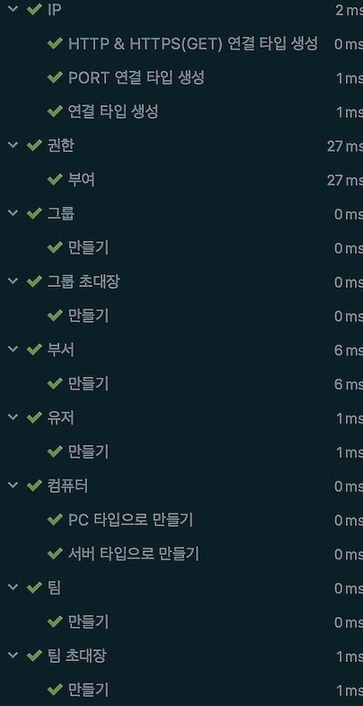

# 소개

#### 팀 단위로 망 연결이 잘 되어 있는지 모니터링 할수 있는 서비스 입니다.

<br>
<br>


---
[](http://www.oineh-monitoring.today/)<br>
</br>


[](https://github.com/oiNeh/tcp)<br>

-9cf?logo=HomeAssistant)

---

# 개발 서버 전체 구조

> Web
>
> > ```Google cloud Platform```
> > - VM (Ubuntu)
> > - 포트 포워딩 80 -> 8080 설정
> > - tomcat
> >
>
> > ```개발용 노트북 맥북```
> > - 빌드,실행 자동화


***

# API 구조

| Method | URL        | 설명    |
|----|------------|-------|
| POST | /api/pc | 내pc 등록 |
| POST | /api/group | 그룹 생성 |
| POST | /api/dept  | 부서 생성 |
| POST | /api/team  | 팀 생성  |

| Method | URL    | 설명     |
|----|---|--------|
| POST | /api/user/signup | 회원가입   |

| Method | URL     | 설명               |
|----|---------|------------------|
| GET | /api/groups/{groupId} | 그룹내 모든 부서와 팀 보기  |
| GET | /api/groups |회원이 속한 그룹 리스트들 보기 |

| Method | URL     | 설명            |
|----|---------|---------------|
| GET | /api/group/invite | 받은 그룹 초대 리스트 확인 |
| PATCH | /api/group/invite | 그룹 초대 받기      |
| DELETE | /api/group/invite | 그룹 초대 거부      |
| POST | /api/group/invite | 그룹 초대 하기      |

| Method | URL     | 설명             |
|----|---------|----------------|
| GET | /api/team/invite | 받은 팀 초대 리스트 확인 |
| PATCH | /api/team/invite | 팀 초대 수락        |
| DELETE | /api/team/invite | 팀 초대 거부        |
| POST | /api/team/invite | 팀 초대 하기        |

| Method | URL     | 설명   |
|----|---------|------|
| POST | /api/team/address/url |모니터링할 URL 을 추가합니다.|
| POST | /api/team/address/ip-port |모니터링할 IP:PORT 을 추가합니다.|
| POST | /api/team/address/ip | 모니터링할 IP 을 추가합니다.|

| Method | URL     | 설명                     |
|----|---------|------------------------|
| GET | /api/address/teams/{teamId} | 주소 리스트를 가져올 수 있습니다. |
| GET |/api/address/teams/{teamId}/connects/{connectId} |  주소 연결 상태를 가져올 수 있습니다. |
| GET |/api/member/teams/{teamId} |  유저 리스트를 가져올 수 있습니다. |
| GET | /api/member/teams/{teamId}/connects/{connectId} | 유저 연결 상태를 가져올 수 있습니다.  |

<br>

---

# 요구 사항

#### 메인 페이지 `URL` : `/`

- 로그인을 하면 화면이 바뀝니다.

#### 로그인 페이지 `URL` : `/login`

- 로그인시 JWT 가 Cookie 에 저장 됩니다.
    - 토큰 유지 시간은 20일 입니다.
- 토큰 만료시 로그인 페이지로 이동합니다.

#### 회원가입 페이지 `URL` : `/signup`

- 회원 가입을 합니다.
    - 이메일 중복 체크를 합니다.
    - 아이디 중복 체크를 합니다.

#### 마이 페이지 `URL` : `/mypage`

- PC를 등록 할 수 있습니다.
    - PC를 등록 해야 팀 페이지에서 상태를 확인 할 수 있습니다.
    - 접속한 PC로 IP를 저장 합니다.
    - '*'내부망접근이 아니라면 잘못된 상태를 줄 수 있습니다.
- 그룹 & 팀 초대 리스트를 볼 수 있습니다.
    - 초대를 수락&거부 할 수 있습니다.

#### 소속된 그룹 페이지 `URL` : `/groups`

- 소속된 모든 그룹들을 보여줌니다.
- 그룹을 생성할수 있습니다.

#### 그룹 페이지 `URL` : `/groups/{group}`

- 부서를 추가할수 있습니다.
    - 부서내 팀을 생성할수있습니다.
    - 팀에 합류 해야지만 부서로 할당되는 방식입니다.
- 팀 영역 클릭시 페이지로 이동합니다.
- 이메일로 그룹원을 초대 합니다.
    - 이미 초대된 유저는 실패 메시지라고 뜸니다

#### 팀 페이지 `URL` : `/groups/{group}/teams/{teams}`

- 실시간으로 모니터링을 볼수 있습니다.
- 등록된 주소 URL,IP,IP:PORT 연결 상태를 확인할 수 있습니다.
    - IP 는 ICMP 방식으로 조회 합니다.
    - URL 는 HTTP/HTTPS GET 방식 으로 조회 합니다.
    - IP:PORT 는 Socket 방식으로 조회 합니다.
        - 각각 다른 방식으로 조회하는 이유는 여러 방화벽으로 조회하지 못할<br>
          상황을 대비해서 이런 방식으로 구현 했습니다.
- PC를 등록한 맴버에 한에서만 연결 상태를 확인할 수 있습니다.
    - 팀원 은 ICMP 방식으로 조회 합니다.
- 모니터링할 주소 URL, IP, IP:PORT 을 추가합니다.
    - IP의 범위는 0~ 255 사이 값 입니다.
- 이메일로 팀원을 초대 합니다.
    - 이미 초대된 유저는 실패 메시지라고 뜸니다

---

# 디자인

도메인 계층별로 패키징 분리 했습니다.

#### Sample

```text
user/domain
    /service
    /web 
    
groups/domain
      /service
      /web 
      
team/domain
    /service
    /web 
...
```

---

# 테스트

#### JUnit 으로 테스트 작성

- 통합 테스트 (api&service)


- Entity 테스트



---

# 배포

shell 스크립트로 서버에 jar 파일 전송하는 스크립트 입니다.

```shell
./server_build
```

## 서버 실행

빌드후 이전 서버 재실행하는 자동화 프로세스 입니다.

```shell
./server_run
```
